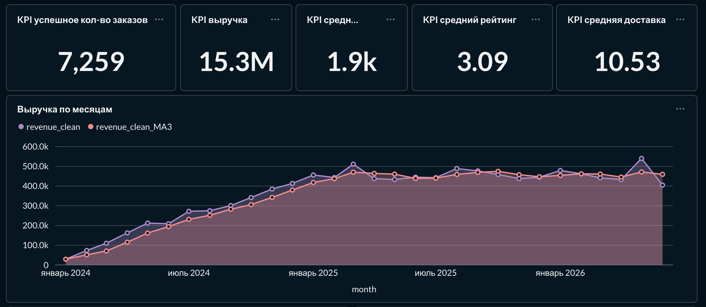
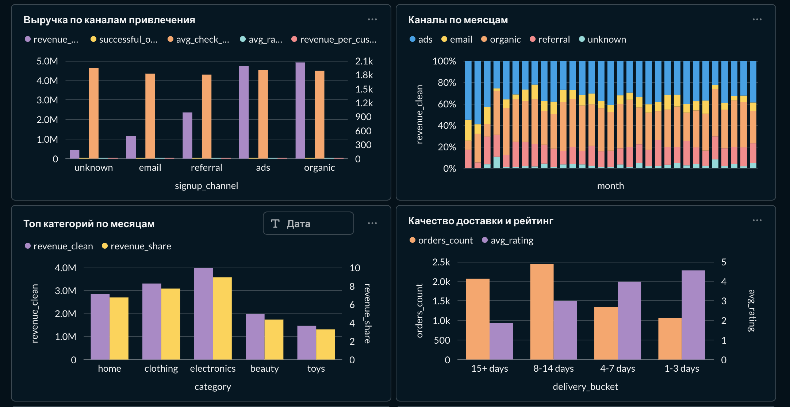
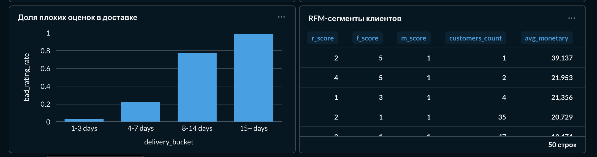
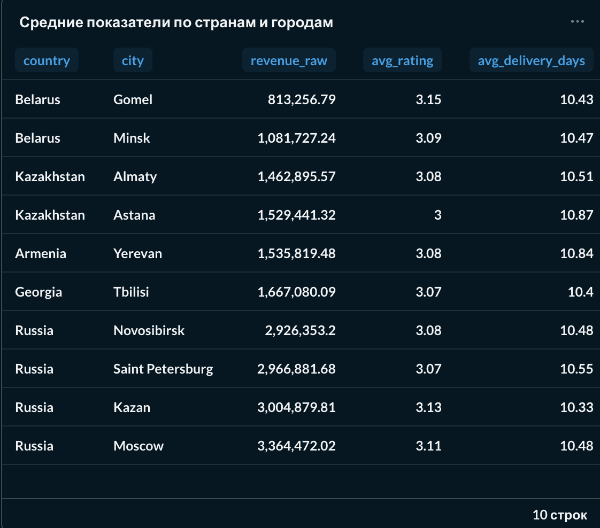

# E-commerce Analytics Demo Project
## О проекте
Проект демонстрирует полный цикл работы аналитика данных на примере e-commerce компании:
1. `Генерация данных` — создание реалистичных датасетов с намеренными проблемами качества
2. `Очистка данных` — профилирование, обработка пропусков, дубликатов, выбросов
3. `Статистический анализ` — проверка двух бизнес-гипотез с использованием статистических тестов
4. `Загрузка в MySQL` — перенос очищенных данных в реляционную базу данных
5. `SQL-аналитика` — создание 8 аналитических VIEW с JOIN, агрегатами и оконными функциями
6. `Визуализация` — интерактивный дашборд в Metabase
7. `Бизнес-выводы` — рекомендации на основе данных

Сфера: электронная коммерция — клиенты и заказы
Период данных: январь 2024 — июль 2026
Объём: окло 2 000 клиентов, около 10 000 заказов


## Структура проекта

```
├── data/
│   ├── raw/                    # Сырые CSV-файлы
│   │   ├── customers.csv
│   │   └── orders.csv
│   └── clean/                  # Очищенные CSV-файлы
│       ├── customers.csv
│       ├── orders.csv
│       └── merged_analysis.csv
│
├── reports/                    # Отчёты и результаты анализа
│   ├── data_quality.csv        	# Отчёт о качестве данных
│   ├── base_metrics.csv        	# Базовые бизнес-метрики
│   └── hypotheses.csv         	 	# Результаты статистических тестов
│
├── scripts/                    # Python-скрипты
│   ├── generate_data.py        	# Генерация сырых данных
│   ├── clean_analyze.py        	# Очистка, анализ, гипотезы
│   └── load_to_mysql.py        	# Загрузка данных в MySQL
│
├── sql/
│   └── views.sql               	# SQL VIEW для аналитики
│
├── img/                     # Скриншоты дашборда
├── requirements.txt            
└── README.md
```


## Данные
### Таблица "customers" — клиенты
- `customer_id` - VARCHAR(20) - уникальный идентификатор клиента
- `registration_date` - DATE - дата регистрации 
- `country` - VARCHAR(50) - страна: Russia, Belarus, Kazakhstan, Armenia, Georgia 
- `city` - VARCHAR(100) - город 
- `age` - INT - возраст клиента
- `signup_channel` - VARCHAR(30) - канал привлечения: organic, ads, referral, email, unknown 
- `marketing_consent` - SMALLINT - согласие на маркетинговые рассылки (0/1)
- `age_missing` - SMALLINT - флаг: возраст был пропущен и заполнен медианой (0/1)

### Таблица "orders" — заказы
- `order_id` - VARCHAR(20) - уникальный идентификатор заказа 
- `customer_id` - VARCHAR(20) - уникальный идентификатор клиента 
- `order_date` - DATE - дата оформления заказа 
- `status` - VARCHAR(20) - статус: completed, delivered, cancelled, processing 
- `category` - VARCHAR(30) - категория товара: electronics, clothing, home, beauty, toys 
- `payment_method` - VARCHAR(20) - способ оплаты: card, cash, sbp, wallet 
- `quantity` - INT - количество товаров в заказе 
- `discount_percent` - INT - размер скидки в процентах (0–30) 
- `amount_raw` - DECIMAL(12,2) - сумма заказа после удаления технических ошибок 
- `amount_clean` - DECIMAL(12,2) - сумма заказа с ограничением статистических выбросов (IQR) 
- `delivery_days` - FLOAT - срок доставки в днях 
- `rating` - FLOAT - оценка клиента от 1 до 5 
- `is_amount_outlier` - SMALLINT - флаг статистического выброса по сумме (0/1) 
- `is_successful` - SMALLINT - успешный заказ: completed или delivered (0/1) 

### Почему две колонки для суммы заказа
- `amount_raw` используется для расчёта выручки — отражает реальные деньги 
- `amount_clean` используется для среднего чека и статистических тестов — не искажается выбросами 

Выбросы определяются методом IQR (межквартильный размах): значения выше Qn ± 1.5 * IQR помечаются флагом и ограничиваются сверху


## Проблемы качества данных
В сырых данных намеренно созданы реалистичные проблемы, которые встречаются в реальных проектах:
- Дубликаты по ключу `customer_id` - удалены, оставлена первая запись 
- Дубликаты по ключу `order_id` - удалены, оставлена первая запись 
- Пропуски `возраста` - заполнены медианным значением 
- Битые `даты регистрации` (`2024-02-30`, пустые) - приведены к NaT, строки удалены 
- Пропуски `канала привлечения` - заменены на `unknown` 
- Пропуски `согласия на маркетинг` - заполнены значением 0 (нет согласия) 
- Отрицательные `суммы заказа` - удалены как технические ошибки 
- Нулевые `суммы заказа` - удалены как технические ошибки 
- Аномально большие `суммы` (> 100 000) - удалены как технические ошибки 
- Грязные `статусы` (Completed, CANCELED, Processing) - нормализованы к нижнему регистру 
- Битые `даты заказов` - приведены к NaT, строки удалены 
- Выбросы `доставки` (999 дней) - заменены на NULL 
- Пропуски `customer_id` - строки удалены 
- Заказы несуществующих `клиентов` (C99999) - строки удалены 
- Заказы клиентов с битой `датой регистрации` - строки удалены (orphan orders) 
- Статистические `выбросы` суммы (IQR) - отмечены флагом, ограничены в `amount_clean` 

### Итог очистки
Таблица "customers"
- Было строк: 2 015 
- Стало строк: 1 990 
- Удалено: 25 

Таблица "orders" 
- Было строк: 10 025 
- Стало строк: 9 756 
- Удалено: 269 


## Статистические гипотезы
### ГИПОТЕЗА 1: Влияет ли канал привлечения на ср. чек?
`Бизнес-вопрос:` Приводит ли платная реклама (ads) клиентов с более высоким средним чеком по сравнению с органическим трафиком (organic)?

`Формулировка:`
- H0: Средний чек успешных заказов клиентов из каналов `ads` и `organic` не различается
- H1: Средний чек различается

Метрика: `amount_clean` (сумма заказа, очищенная от выбросов)

Методология:
- `Mann-Whitney U test` — основной тест, устойчив к скошенному распределению и выбросам
- `Welch t-test на log(amount + 1)` — дополнительный тест для проверки устойчивости результата

Результаты:
| Тест | p-value | Значим при α = 0.05 |
|---|---:|---|
| Mann-Whitney U | 0.798 | Нет |
| Welch t-test (log) | 0.778 | Нет |

Описательная статистика:
| Канал | N | Медиана | Среднее |
|---|---:|---:|---:|
| ads | 2 487 | 1 397 | 1 903 |
| organic | 2 608 | 1 356 | 1 885 |

`Вывод:` Статистически значимой разницы в среднем чеке между каналами `ads` и `organic` не обнаружено
Разница медиан в 41 руб при среднем чеке в 1 900 руб не является практически значимой

`Бизнес-рекомендация:` Не оценивать эффективность каналов только по среднему чеку первого заказа
Необходимо дополнительно анализировать CAC (стоимость привлечения), LTV (пожизненную ценность клиента) и частоту повторных покупок


### ГИПОТЕЗА 2: Влияет ли срок доставки на рейтинг клиента?
`Бизнес-вопрос:` Имеют ли заказы с доставкой дольше 7 дней статистически значимо более низкий рейтинг?

`Формулировка:`
- H₀: Рейтинг заказов с доставкой ≤ 7 дней и > 7 дней не различается
- H₁: Рейтинг различается

Метрика: `rating` (оценка клиента от 1 до 5)

Методология:
- `Mann-Whitney U test` — подходит для порядковых метрик (рейтинг) и скошенных распределений

`Результаты:`
| Тест | p-value | Значим при α = 0.05 |
|---|---:|---|
| Mann-Whitney U | < 0.0001 | Да |

`Описательная статистика:`
| Группа | N | Медиана | Среднее |
|---|---:|---:|---:|
| Доставка ≤ 7 дней | 2 403 | 4.0 | 4.24 |
| Доставка > 7 дней | 4 505 | 2.0 | 2.48 |

`Детализация по срокам доставки:`
| Срок доставки | Кол-во заказов | Ср. рейтинг | Доля плохих оценок |
|---|---:|---:|---:|
| 1–3 дня | 1 063 | 4.56 | 3.3% |
| 4–7 дней | 1 340 | 3.98 | 22.1% |
| 8–14 дней | 2 439 | 3.00 | 76.6% |
| 15+ дней | 2 066 | 1.87 | 99.4% |

`Вывод:` Заказы с доставкой дольше 7 дней имеют статистически значимо более низкий рейтинг (p < 0.0001)
Критическая точка — 7 дней
После этого порога доля плохих оценок резко возрастает с 22% до 77 - 99%

`Бизнес-рекомендация:`
- Ввести SLA на доставку: целевой срок ≤ 7 дней
- Проактивно уведомлять клиентов о задержках
- Мониторить `bad_rating_rate` по курьерским службам и регионам
- Запустить эксперимент: ускоренная доставка для тестовой группы + сравнение рейтинга и повторных покупок


## SQL VIEW
В MySQL создано 8 аналитических представлений, которые потом используются в Metabase:
- `v_orders_enriched` - заказы, обогащённые данными клиентов 
- `v_daily_sales` - продажи по дням 
- `v_monthly_sales_running` - продажи по месяцам с динамикой 
- `v_channel_performance` - эффективность каналов привлечения 
- `v_channel_month` - продажи по каналам и месяцам 
- `v_category_month_rank` - рейтинг категорий по месяцам 
- `v_delivery_quality` - качество доставки и рейтинг 
- `v_customer_rfm` - RFM сегментация клиентов 

### Примеры SQL запросов
1. ПРОДАЖИ ПО МЕСЯЦАМ С:
- агрегацией по месяцам
- running total
- скользящим средним за 3 месяца
- выручкой за прошлый месяц
- month-over-month growth

```sql
WITH mounthly AS (
	SELECT 
		CAST(DATE_FORMAT(order_date, '%Y-%m-01') AS DATE) 		AS month,
        SUM(amount_raw) 				AS revenue_raw,
        SUM(amount_clean) 				AS revenue_clean,
        COUNT(DISTINCT order_id) 		AS orders_count,
        COUNT(DISTINCT customer_id)		AS customers_count,
        ROUND(AVG(amount_clean), 2) 	AS avg_check_clean
	FROM v_orders_joined
    WHERE is_successful = 1
    GROUP BY CAST(DATE_FORMAT(order_date, '%Y-%m-01') AS DATE)
),
mounthly_with_lag AS (
	SELECT 
		month,
        revenue_raw,
        revenue_clean,
        orders_count,
        customers_count,
        avg_check_clean,
        LAG(revenue_clean) OVER(ORDER BY month) AS prev_revenue_clean
		FROM mounthly
)
SELECT
	month,
    revenue_raw,
	revenue_clean,
	orders_count,
	customers_count,
	avg_check_clean,
    SUM(revenue_clean) OVER(ORDER BY month ROWS BETWEEN UNBOUNDED PRECEDING AND CURRENT ROW)          	AS revenue_cleaning_running,
    ROUND(AVG(revenue_clean) OVER(ORDER BY month ROWS BETWEEN 2 PRECEDING AND CURRENT ROW), 2) 			AS revenue_clean_MA3,
    prev_revenue_clean,
    ROUND((revenue_clean - prev_revenue_clean) / NULLIF(prev_revenue_clean, 0) * 100, 2) 				AS MoM_growth_procent
FROM mounthly_with_lag
ORDER BY month
```


2. КАЧЕСТВО ДОСТАВКИ
```sql
CREATE OR REPLACE VIEW v_delivery_quality AS
SELECT
    CASE
        WHEN delivery_days <= 3 THEN '1-3 days'
        WHEN delivery_days <= 7 THEN '4-7 days'
        WHEN delivery_days <= 14 THEN '8-14 days'
        ELSE '15+ days'
    END 										AS delivery_bucket,
    COUNT(*) 									AS orders_count,
	ROUND(AVG(rating), 2) AS avg_rating,
    ROUND(SUM(CASE
            WHEN rating <= 3 THEN 1
            ELSE 0
        END) / NULLIF(COUNT(rating), 0), 2) 	AS bad_rating_rate,
    ROUND(AVG(amount_clean),2) AS avg_check_clean
FROM v_orders_joined
WHERE is_successful = 1
    AND delivery_days IS NOT NULL
    AND rating IS NOT NULL
GROUP BY delivery_bucket;
```    

            

## Дашборд в Metabase
### KPI и динамика выручки


### Каналы, категории и доставка


### Доля плохих оценок и RFM-сегменты


### Средние показатели по странам и городам



### Блоки дашборда
1. `KPI: успешные заказы` показывает общее количество выполненных заказов
2. `KPI: выручка` показывает общую выручку по успешным заказам 
3. `КPI: средний чек` показывает средний чек, очищенный от выбросов
4. `KPI: средний рейтинг` показывает средную оценку клиентов 
5. `KPI: средняя доставка` показывает средний срок доставки в днях
6. `Выручка по месяцам` показывает динамику выручки + скользящее среднее за 3 месяца 
7. `Выручка по каналам` показывает сравнение каналов по выручке 
8. `Топ категорий` показывает рейтинг категорий по выручке
9. `Каналы по месяцам` показывает структуру каналов во времени 
10. `Рейтинг по доставке` показывает зависимость рейтинга от срока доставки
11. `Доля плохих оценок` показывает процент оценок по срокам доставки
12. `RFM-сегменты` показывает сегментацию клиентов по Recency (как давно клиент покупал), Frequency (как часто покупал), Monetary (сколько денег принес)
13. `Средние показатели по странам и городам`


## Ключевые бизнес-выводы
### 1. Доставка — главная проблема клиентского опыта
- Средний рейтинг 3.09 из 5 ниже нормы (для e-commerce обычно выше 4.0)
- 65.2% заказов доставляются дольше 7 дней
- При доставке более 15 дней 99% оценок — плохие
- Связь статистически значима (p < 0.0001)

`Рекомендации:`
- Ввести SLA на доставку с целевым сроком менее 7 дней
- Оптимизировать логистику для регионов с худшими показателями
- Проактивно уведомлять клиентов о задержках
- Мониторить долю плохих оценок как операционный KPI


### 2. Каналы привлечения не различаются по среднему чеку
- Средний чек 1 873.04 рубля по всем каналам (p = 0.798)
- Разница между каналами мала и не является практически значимой
- Email — слабый канал по объёму выручки

`Рекомендации:`
- В рамках этих данных канал привлечения не влияет на денежну ценность клиента
- Ads и organic - основные каналы по объему
- Пересмотреть стратегию по email, так как канал дает наименьший объем выручки
- Улучшить трекинг источников (226 заказов с каналом `unknown`)


### 3. Концентрация выручки в топ-3 категориях
- Electronics + clothing + home = 75% выручки
- Toys имеет самый высокий средний чек (1 966 руб), но наименьшую долю

`Рекомендации:`
- Развивать beauty и toys через кросс-продажи
- Проверить маржинальность каждой категории
- Для топовых категорий обеспечить наличие и промо-поддержку


### 4. Повторные покупки и RFM сегментация
- 7 259 успешных заказов на 1 941 клиента (3.7 заказ в среднем на клиента)
- Большинство клиентов совершают повторные покупки, а не уходят после первого заказа
- Ценность RFM в таргетинге. Комбинации оценок позволяют отбирать сегменты для точечных кампаний (например, высокий monetary + большой recency = ценные клиенты под риском оттока)

`Рекомендации:`
- Мониторить долю клиентов с единственным заказом (frequency = 1) как метрику лояльности
- Анализировать повторные покупки когортами по месяцу регистрации
- Запустить кампанию возврата для сегмента с высоким m_score и большим recent_day


### 5. Устойчивый рост выручки при умеренной концентрации каналов
- Выручка стабильно растёт на протяжении 2.5 лет
- Основные каналы — organic и ads 

`Рекомендации:`
- Развивать referral и email как страховку от подорожания/отключения одного из каналов
- Мониторить максимальную месячную долю канала как метрику концентрации риска


## Ограничения проекта
- Данные синтетические, сгенерированы скриптом — не отражают реальные бизнес-процессы
- Нет данных о стоимости привлечения клиентов (CAC)
- Нет данных о возвратах и отменах после доставки
- Нет сессионных данных (конверсия, воронка, поведение на сайте)
- Нет данных о маржинальности категорий (выручка ≠ прибыль)
- Пик выручки в июле 2026 — артефакт генерации данных (обрезка дат по верхней границе периода)
- Статистические тесты проверяют связь, но не устанавливают причинно-следственную связь


## Возможные улучшения
- Интеграция данных из рекламных кабинетов для расчёта CAC
- Добавление таблицы возвратов для дальнейшего анализа 
- Когортный анализ удержания клиентов
- Предиктивная модель оттока клиентов
- A/B-тестирование ускоренной доставки
- Переход на реальные данные после валидации методологии


